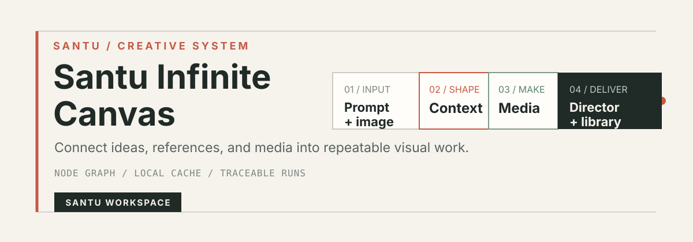
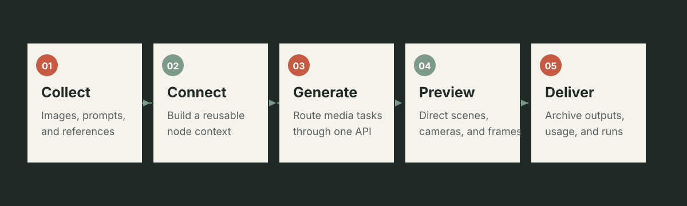
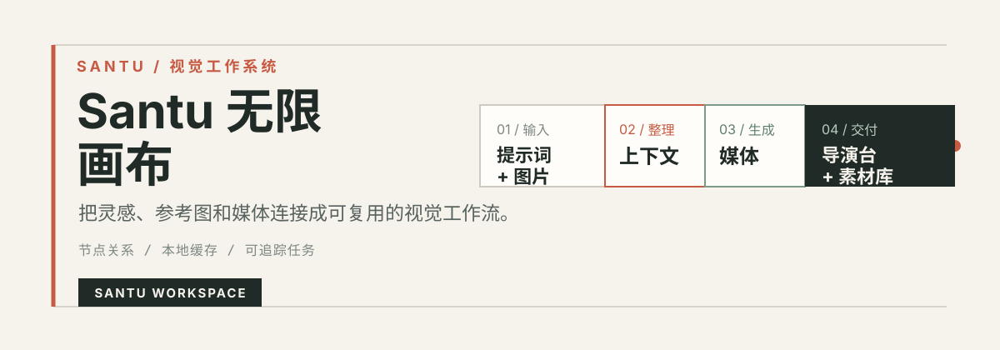
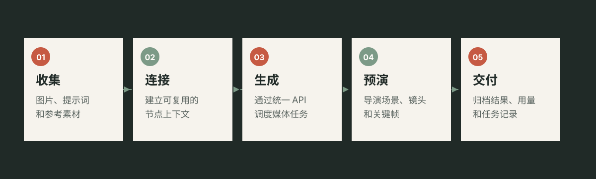

# Santu Infinite Canvas

[**EN**](#santu-infinite-canvas) · [中文](#santu-无限画布)

Santu Infinite Canvas is a local-first, single-user AI creative desktop workspace. It connects prompts, references, generated media, and delivery work on one reusable canvas without requiring an account.

<p align="center">
  
</p>

## Product model

- One local workspace per computer; no login, employee management, roles, or tenant administration
- Local canvas projects, assets, prompt library, generated media, and task history
- Separate local API settings for image, text, video, audio, and music providers
- API credentials are encrypted at rest by the local Node service and are never returned to the browser
- The production Node service serves both the built web app and `/api`
- Electron desktop shell for Windows installer and portable builds

<p align="center">
  
</p>

## Features

- Infinite canvas with movable, connected, and reusable nodes
- Image generation, editing, references, outpainting, and upscaling
- Video, audio, and music workflows with retryable task records
- Director workspace for scenes, cameras, timelines, and PNG/MP4 exports
- Local project library, assets, prompt library, import, export, and automatic persistence

## Director workspace

The embedded Director workspace contains source-level adaptations and compatible assets derived from [MONOFORM Previs Studio](https://github.com/GuiYi-Xi/monoform-previs-studio). Its focused previs workflow includes:

- Building scenes with characters, primitive geometry, props, and imported GLB/GLTF models
- Posing rigged characters with presets, bone controls, IK handles, and optional reference images
- Selecting a scene object or joint before using `W` to move or `E` to rotate; `Q` returns to posing/selection mode
- Blender-style views: numpad `1` front, `3` right, `7` top, and `9` left
- Managing multiple shots with independent scenes, camera framing, focal lengths, aspect ratios, and thumbnails
- Animating cameras, characters, and scene objects on a keyframe timeline
- Exporting camera views as PNG, timeline previews as MP4, and editable projects as JSON

Original MONOFORM resources:

- [Watch the 8-minute getting-started video](https://guiyi-xi.github.io/monoform-previs-studio/tutorial/monoform-getting-started.mp4)
- [Read the original user guide](https://github.com/GuiYi-Xi/monoform-previs-studio/blob/main/docs/USER_GUIDE.md)
- [View the source project](https://github.com/GuiYi-Xi/monoform-previs-studio)

The points above are summarized from the upstream README. Santu adapts the embedded workspace for its infinite-canvas, local persistence, and screenshot-return workflow, so some interface details may differ from the original tutorial.

## Run from source

Requirements: Node.js 24 or later and pnpm.

```bash
pnpm install
pnpm build
pnpm start
```

Open `http://127.0.0.1:5200`. The production command runs one Node process and serves the files in `dist/`; Vite is not required at runtime.

- macOS: double-click `启动.command`
- Windows: double-click `启动-Windows.bat`
- Development only: run `pnpm dev:backend` and `pnpm dev` in separate terminals

## Desktop app

### Install the packaged app

For end users, use the direct download for your platform:

- Windows: [download the Windows ZIP](https://github.com/J-SanTu/infinite-canvas-studio/releases/download/v0.2.3/Santu.Infinite.Canvas-0.2.3-win.zip), extract it, and run `Santu Infinite Canvas.exe`.
- macOS Apple Silicon: [download the DMG](https://github.com/J-SanTu/infinite-canvas-studio/releases/download/v0.2.3/Santu.Infinite.Canvas-0.2.3-arm64.dmg), open it, and drag the app to Applications. The app is unsigned; on first launch use Control-click, choose **Open**, and confirm.

The packaged apps include their runtime and do not require Node.js, pnpm, or a separate launcher.

### Run from the source bundle

This repository contains the upload-ready source. To run it locally, open a terminal in the repository root:

```bash
pnpm install
pnpm build
pnpm start
```

Then open `http://127.0.0.1:5200`. Do not upload `node_modules`, generated `dist`, or local platform archives.

```bash
pnpm desktop
```

Build the Windows installer and portable executable on Windows:

```bash
pnpm pack:win
```

Build macOS Apple Silicon DMG and ZIP packages:

```bash
pnpm pack:mac
```

Windows artifacts are written to the top-level `Windows/` folder; macOS artifacts are written to the top-level `macOS/` folder. These folders contain delivery packages only and are ignored by Git. See [RELEASE.md](./RELEASE.md) for separate GitHub upload instructions.

Download the v0.2.3 Windows ZIP or macOS ARM64 DMG from the release links above. The release also includes source, macOS ZIP, and Windows installer/portable packages.

On an Apple Silicon Mac, `pnpm pack:win:zip` creates the Windows x64 ZIP. Use the Windows GitHub Actions workflow for the installer and portable EXE.

Electron starts the local service on a random loopback port and stores runtime data in the operating system's application-data directory. Closing the desktop app stops the service.

## First launch

The local API settings page opens automatically when no provider has been configured. Each capability accepts:

- Base URL
- API Key
- Model names

Keys stay in local runtime data and are excluded from project exports. Do not commit `.env`, `server/data/`, `Windows/`, `macOS/`, generated media, or provider credentials.

## Verification

```bash
pnpm typecheck
pnpm build
pnpm test:local
pnpm test:top-nav-static-ui
pnpm test:director-static-ui
```

## Project layout

- `src/` - React UI, canvas, local project library, media workflows, and settings
- `server/` - local storage, encrypted API configuration, provider proxy, and task records
- `desktop/` - Electron main process and desktop startup
- `dist/` - production frontend generated by Vite
- `public/` - static assets and the Director workspace bundle
- `Windows/` - local Windows delivery packages (ignored by Git)
- `macOS/` - local macOS delivery packages (ignored by Git)
- `最终交付/` - two final ZIP bundles for handoff (ignored by Git)

## License and attribution

See [LICENSE](./LICENSE) and [UPSTREAM.md](./UPSTREAM.md). Runtime projects, API credentials, generated media, and local databases are not part of the repository.

---

# Santu 无限画布

[EN](#santu-infinite-canvas) · [**中文**](#santu-无限画布)

Santu 无限画布是一套本地优先、单机单用户的 AI 创作桌面工作区。它把提示词、参考素材、生成任务和交付内容连接在同一张可复用画布中，打开后无需注册或登录。

<p align="center">
  
</p>

## 版本规则

- 每台电脑只有一个本地工作区，不包含账号、员工、角色、租户或管理员体系
- 画布项目、素材、提示词、生成媒体和任务记录保存在本机
- 图片、文本、视频、音频和音乐 API 分开配置
- API Key 由本地 Node 服务加密保存，不会通过接口返回给浏览器
- 正式运行时由同一个 Node 服务提供 `dist` 页面和 `/api`
- 使用 Electron 生成 Windows 安装版和便携版

<p align="center">
  
</p>

## 功能

- 支持移动、连接和复用节点的无限画布
- 图片生成、编辑、参考图、扩图和超分
- 视频、音频、音乐工作流与可重试任务记录
- 导演台：场景、镜头、时间轴以及 PNG / MP4 导出
- 本地项目列表、素材库、提示词库、导入导出和自动保存

## 导演台

本项目内嵌的导演台包含源自 [MONOFORM 素形白模预演工作台](https://github.com/GuiYi-Xi/monoform-previs-studio) 的源码级适配和兼容资源，主要预演能力包括：

- 使用人物、基础几何体、场景道具和导入的 GLB / GLTF 模型快速搭建场景
- 通过动作预设、骨骼控制点、手脚 IK 和参考图调整人物姿势
- 点击场景物体或关节点后，按 `W` 移动、按 `E` 旋转；按 `Q` 返回人物摆姿/选择模式
- Blender 式视图：小键盘 `1` 前视、`3` 右视、`7` 顶视、`9` 左视
- 管理多个独立镜头，设置摄像机构图、焦距、画幅比例和镜头缩略图
- 在时间轴上为摄像机、人物和场景物体制作关键帧动画
- 将摄像机画面导出为 PNG、将时间轴预演导出为 MP4，并用 JSON 工程文件继续编辑

MONOFORM 原项目资料：

- [观看约 8 分钟的入门操作视频](https://guiyi-xi.github.io/monoform-previs-studio/tutorial/monoform-getting-started.mp4)
- [查看原版使用说明](https://github.com/GuiYi-Xi/monoform-previs-studio/blob/main/docs/USER_GUIDE.md)
- [查看功能来源项目](https://github.com/GuiYi-Xi/monoform-previs-studio)

以上要点根据源项目 README 归纳。Santu 内嵌版已针对无限画布、本地保存和截图回传流程进行适配，因此部分界面细节可能与原教程略有不同。

## 从源码运行

需要 Node.js 24 或更高版本以及 pnpm。

```bash
pnpm install
pnpm build
pnpm start
```

打开 `http://127.0.0.1:5200`。正式运行只启动一个 Node 进程，由它直接提供 `dist/` 文件，不再依赖 Vite 开发服务器。

- macOS：双击 `启动.command`
- Windows：双击 `启动-Windows.bat`
- 开发模式：分别运行 `pnpm dev:backend` 和 `pnpm dev`

## 桌面版

### 安装已打包版本

普通用户可直接选择对应平台下载：

- Windows：[下载 Windows ZIP](https://github.com/J-SanTu/infinite-canvas-studio/releases/download/v0.2.3/Santu.Infinite.Canvas-0.2.3-win.zip)，解压后运行 `Santu Infinite Canvas.exe`。
- Apple 芯片 macOS：[下载 DMG](https://github.com/J-SanTu/infinite-canvas-studio/releases/download/v0.2.3/Santu.Infinite.Canvas-0.2.3-arm64.dmg)，打开后将应用拖到“应用程序”。应用当前未签名，首次启动请按住 Control 点击，选择“打开”并确认。

打包应用已包含运行所需环境，不需要另外安装 Node.js、pnpm，也不需要启动脚本。

### 从源码文件夹运行

当前仓库已经包含完整源码。在仓库根目录打开终端：

```bash
pnpm install
pnpm build
pnpm start
```

然后打开 `http://127.0.0.1:5200`。不要上传 `node_modules`、生成的 `dist` 或本地平台 ZIP 包。

本机启动 Electron：

```bash
pnpm desktop
```

在 Windows 上生成安装版和便携版：

```bash
pnpm pack:win
```

生成 macOS Apple 芯片版 DMG 和 ZIP：

```bash
pnpm pack:mac
```

Windows 产物写入项目根目录的 `Windows/`，macOS 产物写入项目根目录的 `macOS/`。这两个目录只放交付包，并已加入 Git 忽略规则。分平台上传 GitHub 的方法见 [RELEASE.md](./RELEASE.md)。

交付时可使用上方链接中的 v0.2.3 Windows ZIP 和 macOS ARM64 DMG；发布页还提供源码、macOS ZIP、Windows 安装版和便携版。

Apple 芯片 Mac 可运行 `pnpm pack:win:zip` 生成 Windows x64 ZIP；安装版和便携版 EXE 请使用 Windows GitHub Actions 工作流生成。

Electron 会在随机的本机回环端口启动服务，并把数据库、素材、密钥和运行记录保存到操作系统的应用数据目录。关闭桌面应用时，本地服务同时退出。

## 首次启动

当本机还没有任何服务商配置时，应用会自动打开 API 设置。每项配置包含：

- Base URL
- API Key
- 模型名称

密钥不会写入浏览器存储，也不会进入项目导出文件。不要提交 `.env`、`server/data/`、`Windows/`、`macOS/`、生成媒体或服务商凭据。

## 验证

```bash
pnpm typecheck
pnpm build
pnpm test:local
pnpm test:top-nav-static-ui
pnpm test:director-static-ui
```

## 项目结构

- `src/` - React 界面、无限画布、本地项目管理、媒体工作流和设置
- `server/` - 本地存储、加密 API 配置、服务商代理和任务记录
- `desktop/` - Electron 主进程和桌面启动逻辑
- `dist/` - Vite 生成的正式前端
- `public/` - 静态资源与导演台工作区
- `Windows/` - 本地 Windows 交付包（Git 忽略）
- `macOS/` - 本地 macOS 交付包（Git 忽略）
- `最终交付/` - 仅含两个最终 ZIP 的交付目录（Git 忽略）

## 许可证与署名

许可证和上游来源请查看 [LICENSE](./LICENSE) 与 [UPSTREAM.md](./UPSTREAM.md)。本地项目、API 凭据、生成媒体和运行数据库不属于仓库内容。
